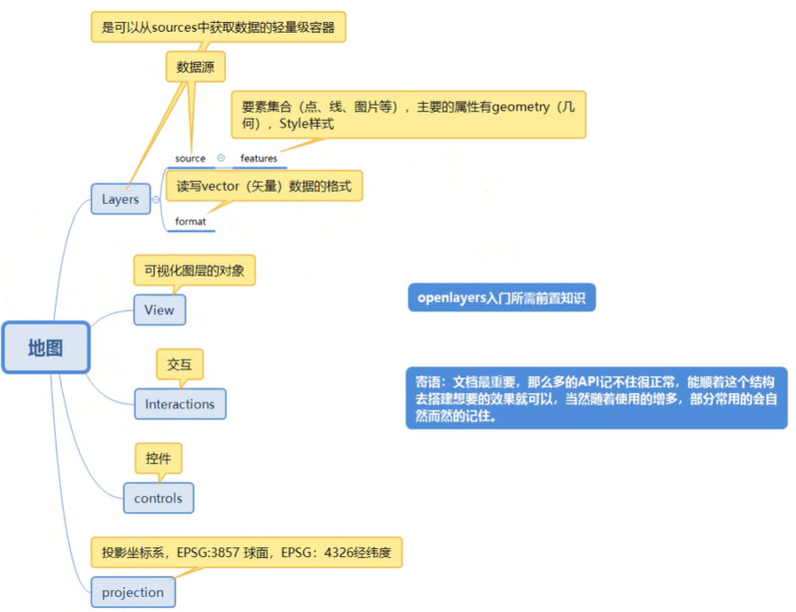
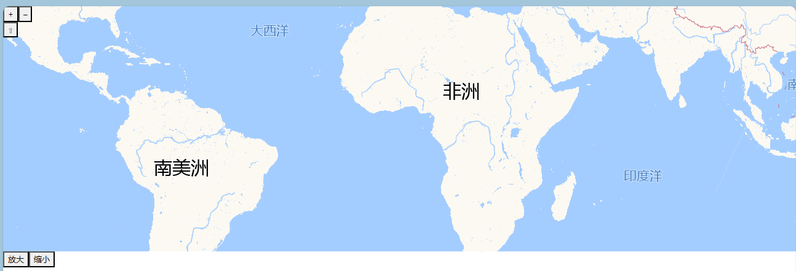

# 基本概念



## 生成一个基本的地图



html:

```html
<template>
  <div>
    <div id="map" class="map" tabindex="0"></div>
    <button id="zoom-out" @click="bigOrSmall('big')">放大</button>
    <button id="zoom-in" @click="bigOrSmall('small')">缩小</button>
  </div>
</template>
```

**vue**:

```js
import Map from 'ol/Map.js';
import TileLayer from 'ol/layer/Tile.js';
import View from 'ol/View.js';
import XYZ from 'ol/source/XYZ'
export default {
    data() {
        return {
            map: null,
        }
    },
    mounted() {
        this.initMap()
    },
    methods: {
        initMap() {
            this.map = new Map({
                layers: [      //图层数组，可视内容实际由各个图层堆叠而成
                    new TileLayer({    //瓦片图层
                        source: new XYZ({   //数据源
                            url: 'http://wprd0{1-4}.is.autonavi.com/appmaptile?x={x}&y={y}&z={z}&lang=zh_cn&size=1&scl=1&style=7'
                        })
                    }),
                ],
                target: 'map',
                view: new View({   //视图设置
                    center: [0, 0],  //设置地图的初始显示区域将以经度 0 和纬度 0 为中心
                    zoom: 2,
                }),
            });
        },

        bigOrSmall(str) {
            const view = this.map.getView();     //获取获取当前地图的视图对象
            const zoom = view.getZoom();           //获取缩放级别
            if (str == 'big') {
                view.setZoom(zoom + 1);    //将层级放大
            } else {
                view.setZoom(zoom - 1);    //将层级减少
            }
        }
    },
};
```

css:

```css
.map {
  width: 100%;
  height: 400px;
}

a.skiplink {
  position: absolute;
  clip: rect(1px, 1px, 1px, 1px);
  padding: 0;
  border: 0;
  height: 1px;
  width: 1px;
  overflow: hidden;
}

a.skiplink:focus {
  clip: auto;
  height: auto;
  width: auto;
  background-color: #fff;
  padding: 0.3em;
}

#map:focus {
  outline: #4A74A8 solid 0.15em;
}
```

## 台风实例

数据可获取 台风路径 网通过控制台获取台风路径数据，之后将数据放置在public下的json文件中(自己创建)，这样可用ajax来请求本地文件来模拟网络请求

### 绘制点

```js
initMap() {
    this.map = new Map({
        layers: [      //图层数组，可视内容实际由各个图层堆叠而成
            new TileLayer({    //瓦片图层
                source: new XYZ({   //数据源
                    url: 'http://wprd0{1-4}.is.autonavi.com/appmaptile?x={x}&y={y}&z={z}&lang=zh_cn&size=1&scl=1&style=7'
                })
            }),
        ],
        target: 'map',
        view: new View({   //视图设置
            center: [20037508, 1746891],  //设置地图的初始显示区域
            zoom: 3,
        }),
    });
},

    getData() {
        getData().then(res => {
            const { data } = res;
            let points = data.points;  //获取到了台风路径数据
            let features = [];   //用于存储地理要素
            points.forEach(k => {
                let position = [k.lng, k.lat];  //点的经纬度
                let featurePoint = new Feature({
                    // geometry  用来指明地理要素的几何形状，这里指明为 点
                    // 地图的投影如果不做说明则 默认的是3857即球面投影，所以可以使用fromLonLat将经纬度转换为球面投影
                    geometry:new point(fromLonLat(position))
                });
                features.push(featurePoint)
            })

            // 矢量图层
            let layer = new Vector()
            //矢量数据源
            let source = new VectorSource();
            // source.addFeature(features); 不加s表示只添加一个feature，加上可以添加数组
            source.addFeatures(features); //为数据源添加地理要素
            layer.setSource(source);  //为图层添加数据源
            this.map.addLayer(layer)  //为视图添加图层
        })
    },
```

### 添加样式(setStyle)

```js
//接绘制点后，可以在将单个要素保存到要素数组前，设置其样式
points.forEach(k => {
    let position = [k.lng, k.lat];  //点的经纬度
    let featurePoint = new Feature({
        geometry:new point(fromLonLat(position))
    });
    featurePoint.setStyle(new Style({    //为要素对象设置颜色需要使用setStyle方法,并需要引入一个Style对象
        image:new Circle({     //声明样式形状为圆形(可以使用其他形状，同样需要引入)
            fill: new Fill({   //声明填充颜色，也需要引入fill对象
                color:this.judgeColorByWindLevel(k.strong)
            }),
            radius:4    //设置圆形样式的半径
        })
    }))
    features.push(featurePoint)
})
```

### 绘制连线

连线有两种：

- **LineString**：一般用于控制两点之间的连线，也就是需要精准的控制每一条线时，使用这个
- **MultiLineString**：一般用于控制多点之间的连线，想要一次性控制所有连线时使用这个

这里不对连线做特殊处理，所以使用==MultiLineString==一次性渲染所有连线【**注意**:==连线需要设置开始、结束坐标==】

```js
//接上回设置好点的样式之后，在遍历点的信息的同时，获取该点以及下一个点的坐标信息，用于连线
let linePosition = [];  //存储连线的起始坐标数组
points.forEach((k, index) => {
    let position = [k.lng, k.lat];  
    let featurePoint = new Feature({
        geometry: new point(fromLonLat(position))
    });
    featurePoint.setStyle(new Style({  
        image: new Circle({   
            fill: new Fill({  
                color: this.judgeColorByWindLevel(k.strong)
            }),
            radius: 4    
        })
    }))
    features.push(featurePoint)

    if (index != points.length - 1) {   
        let nextPosition = [points[index + 1].lng, points[index + 1].lat]; //获取下一个点的坐标
        linePosition.push([fromLonLat(position), fromLonLat(nextPosition)])  //保存连线的开始、结尾坐标数组
    }
})

let  lineFeature=new  Feature({  //设置多点连线要素
    geometry:new MultiLineString(linePosition)
})
features.push(lineFeature)
```

#### 定时绘制点与连线

```js
setTimeCreatePointLine(points) {  //参数points为点的坐标系信息以及描述
    let index = 0;
    let layer = new VectorLayer();
    let source = new VectorSource();
    layer.setSource(source)
    let lineSetTime = setInterval(() => {
        if (index == points.length - 1) clearInterval(lineSetTime);
        let position = [points[index].lng, points[index].lat];
        let featurePoint = new Feature({
            geometry: new point(fromLonLat(position))
        })
        featurePoint.setStyle(new Style({
            image: new Circle({
                fill: new Fill({
                    color: this.judgeColorByWindLevel(points[index].strong)
                }),
                radius: 4
            })
        }))
        source.addFeature(featurePoint);

        if (index < points.length - 1) {
            let nextPosition = [points[index + 1].lng, points[index + 1].lat];
            let featureLine = new Feature({
                geometry: new LineString([fromLonLat(position), fromLonLat(nextPosition)])
            })
            source.addFeature(featureLine)
        }
        index++;

    }, 200)

    this.map.addLayer(layer)
},
```


### 绘制风圈

